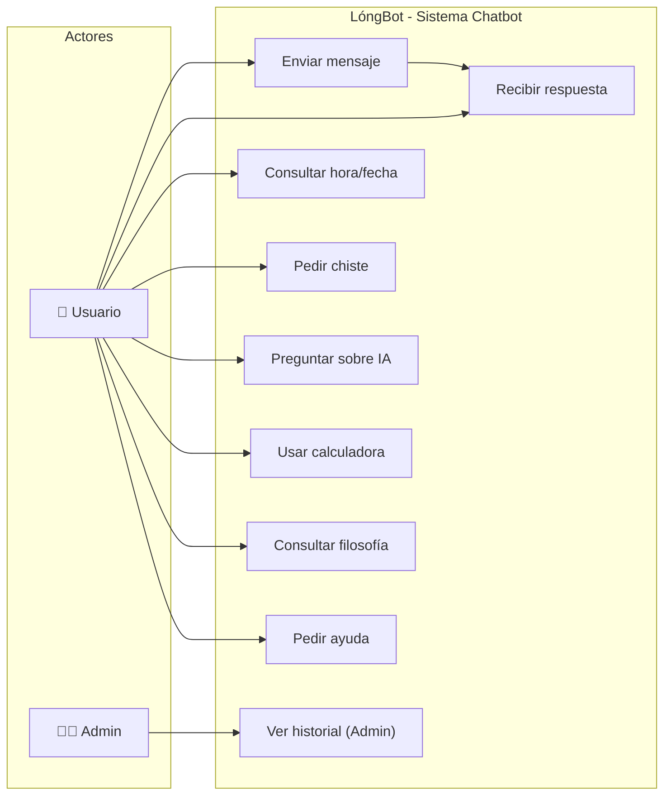

# Diagrama de Casos de Uso — LóngBot

Este diagrama muestra las interacciones principales entre el usuario y el sistema.

## Descripción de Casos de Uso

| Caso de Uso | Actor | Descripción |
|---|---|---|
| Enviar mensaje | Usuario | El usuario escribe un mensaje en la interfaz del chat |
| Recibir respuesta | Usuario | El sistema responde con la intención detectada |
| Consultar hora/fecha | Usuario | Obtener la hora o fecha actual |
| Pedir chiste | Usuario | Solicitar contenido humorístico |
| Preguntar sobre IA | Usuario | Consultar sobre inteligencia artificial |
| Usar calculadora | Usuario | Realizar operaciones matemáticas (+, -, *, /) |
| Consultar filosofía | Usuario | Obtener citas y enseñanzas chinas |
| Pedir ayuda | Usuario | Ver el menú de funcionalidades |
| Ver historial | Admin | Consultar conversaciones previas (Django Admin) |
