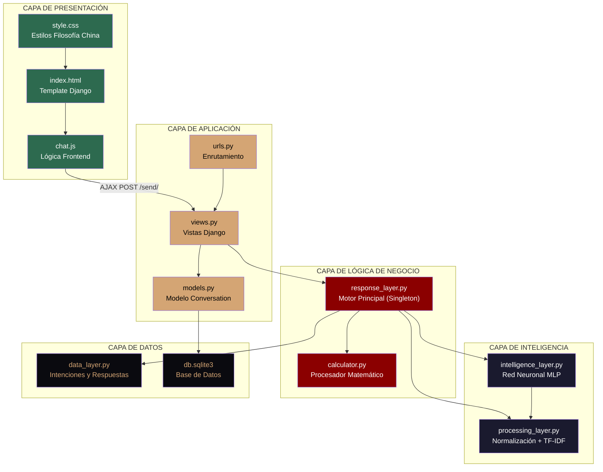

# Diagrama de Arquitectura (Capas) — LóngBot

Este diagrama muestra la arquitectura en capas del sistema.

## Responsabilidades por Capa

| Capa | Componente | Responsabilidad |
|---|---|---|
| Presentación | `index.html`, `style.css`, `chat.js` | Interfaz de usuario, interactividad, diseño visual |
| Aplicación | `views.py`, `urls.py`, `models.py` | Gestión HTTP, enrutamiento, persistencia |
| Lógica de Negocio | `response_layer.py`, `calculator.py` | Orquestación, detección de operaciones |
| Inteligencia | `processing_layer.py`, `intelligence_layer.py` | NLP, vectorización TF-IDF, red neuronal |
| Datos | `data_layer.py`, `db.sqlite3` | Base de conocimiento, almacenamiento |
