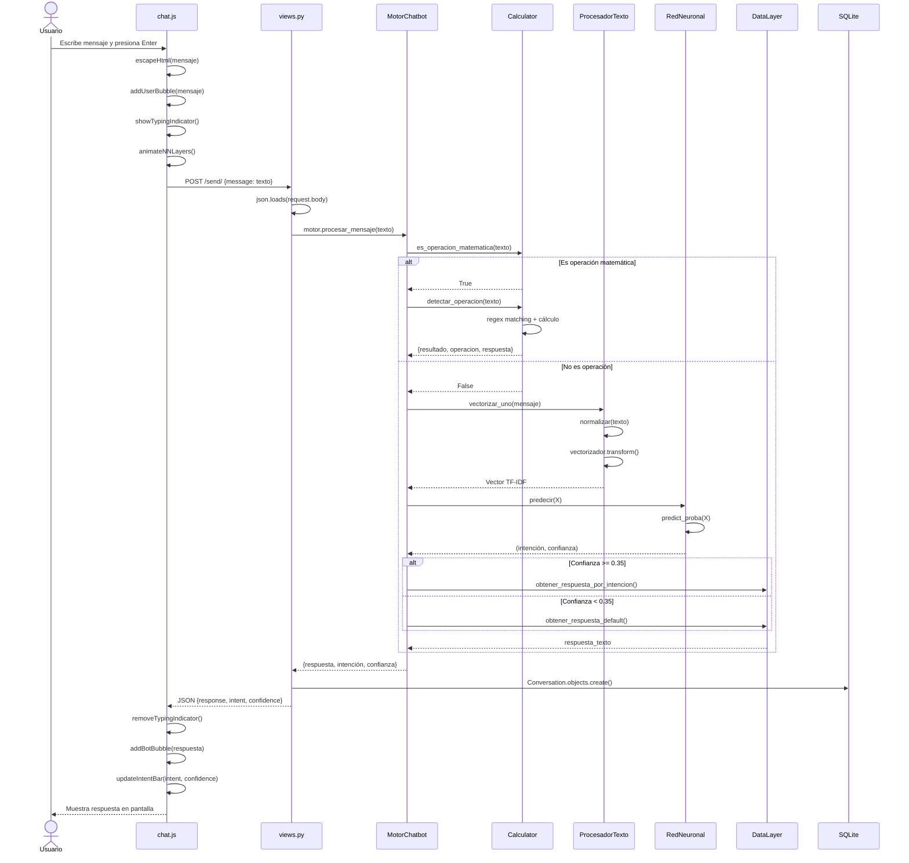
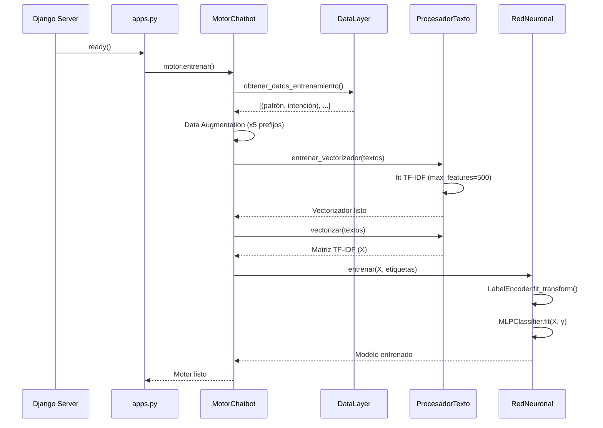

# Diagrama de Secuencia — LóngBot

## Flujo Principal: Envío de Mensaje

```mermaid
sequenceDiagram
    actor U as Usuario
    participant JS as chat.js
    participant V as views.py
    participant RL as MotorChatbot
    participant CALC as Calculator
    participant PL as ProcesadorTexto
    participant IL as RedNeuronal
    participant DL as DataLayer
    participant DB as SQLite

    U->>JS: Escribe mensaje y presiona Enter
    JS->>JS: escapeHtml(mensaje)
    JS->>JS: addUserBubble(mensaje)
    JS->>JS: showTypingIndicator()
    JS->>JS: animateNNLayers()
    
    JS->>V: POST /send/ {message: texto}
    V->>V: json.loads(request.body)
    V->>RL: motor.procesar_mensaje(texto)
    
    RL->>CALC: es_operacion_matematica(texto)
    
    alt Es operación matemática
        CALC-->>RL: True
        RL->>CALC: detectar_operacion(texto)
        CALC->>CALC: regex matching + cálculo
        CALC-->>RL: {resultado, operacion, respuesta}
    else No es operación
        CALC-->>RL: False
        RL->>PL: vectorizar_uno(mensaje)
        PL->>PL: normalizar(texto)
        PL->>PL: vectorizador.transform()
        PL-->>RL: Vector TF-IDF
        RL->>IL: predecir(X)
        IL->>IL: predict_proba(X)
        IL-->>RL: (intención, confianza)
        
        alt Confianza >= 0.35
            RL->>DL: obtener_respuesta_por_intencion()
        else Confianza < 0.35
            RL->>DL: obtener_respuesta_default()
        end
        DL-->>RL: respuesta_texto
    end
    
    RL-->>V: {respuesta, intención, confianza}
    V->>DB: Conversation.objects.create()
    V-->>JS: JSON {response, intent, confidence}
    
    JS->>JS: removeTypingIndicator()
    JS->>JS: addBotBubble(respuesta)
    JS->>JS: updateIntentBar(intent, confidence)
    JS-->>U: Muestra respuesta en pantalla
```

## Flujo de Entrenamiento (al iniciar el servidor)

```mermaid
sequenceDiagram
    participant DJ as Django Server
    participant APP as apps.py
    participant RL as MotorChatbot
    participant DL as DataLayer
    participant PL as ProcesadorTexto
    participant IL as RedNeuronal

    DJ->>APP: ready()
    APP->>RL: motor.entrenar()
    RL->>DL: obtener_datos_entrenamiento()
    DL-->>RL: [(patrón, intención), ...]
    RL->>RL: Data Augmentation (x5 prefijos)
    RL->>PL: entrenar_vectorizador(textos)
    PL->>PL: fit TF-IDF (max_features=500)
    PL-->>RL: Vectorizador listo
    RL->>PL: vectorizar(textos)
    PL-->>RL: Matriz TF-IDF (X)
    RL->>IL: entrenar(X, etiquetas)
    IL->>IL: LabelEncoder.fit_transform()
    IL->>IL: MLPClassifier.fit(X, y)
    IL-->>RL: Modelo entrenado
    RL-->>APP: Motor listo
```
