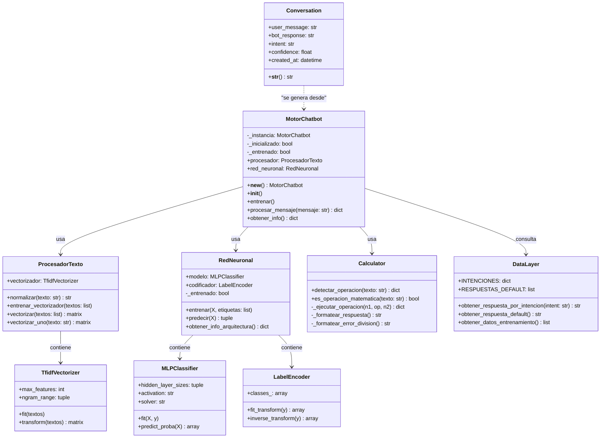

# Diagrama de Clases — LóngBot

Modelo de clases del sistema con relaciones y métodos principales.

## Patrones de Diseño Utilizados

| Patrón | Clase | Descripción |
|---|---|---|
| **Singleton** | `MotorChatbot` | Una sola instancia del motor en toda la aplicación |
| **Layered Architecture** | Todo el sistema | Separación en capas de datos, procesamiento, inteligencia y aplicación |
| **Strategy** | `Calculator` / `RedNeuronal` | Diferentes estrategias de procesamiento según el tipo de entrada |
| **MVC** | `views.py` / `models.py` / `templates/` | Modelo-Vista-Controlador de Django |
