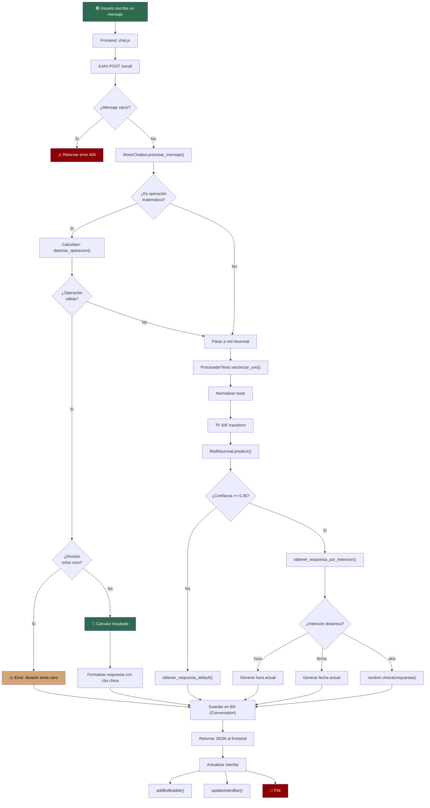

# Diagrama de Flujo — LóngBot

## Flujo de Procesamiento de Mensajes

```mermaid
flowchart TD
    A["🟢 Usuario escribe un mensaje"] --> B["Frontend: chat.js"]
    B --> C["AJAX POST /send/"]
    C --> D{"¿Mensaje vacío?"}
    D -->|Sí| E["⚠️ Retornar error 400"]
    D -->|No| F["MotorChatbot.procesar_mensaje()"]
    
    F --> G{"¿Es operación<br/>matemática?"}
    G -->|Sí| H["Calculator: detectar_operacion()"]
    H --> I{"¿Operación<br/>válida?"}
    I -->|Sí| J{"¿División<br/>entre cero?"}
    J -->|Sí| K["⚠️ Error: división entre cero"]
    J -->|No| L["🔢 Calcular resultado"]
    L --> M["Formatear respuesta con cita china"]
    I -->|No| N["Pasar a red neuronal"]
    
    G -->|No| N
    N --> O["ProcesadorTexto.vectorizar_uno()"]
    O --> O1["Normalizar texto"]
    O1 --> O2["TF-IDF transform"]
    O2 --> P["RedNeuronal.predecir()"]
    P --> Q{"¿Confianza >= 0.35?"}
    Q -->|Sí| R["obtener_respuesta_por_intencion()"]
    Q -->|No| S["obtener_respuesta_default()"]
    
    R --> T{"¿Intención dinámica?"}
    T -->|hora| U["Generar hora actual"]
    T -->|fecha| V["Generar fecha actual"]
    T -->|otra| W["random.choice(respuestas)"]
    
    K --> X
    M --> X
    S --> X
    U --> X
    V --> X
    W --> X
    
    X["Guardar en BD (Conversation)"] --> Y["Retornar JSON al frontend"]
    Y --> Z["Actualizar interfaz"]
    Z --> Z1["addBotBubble()"]
    Z --> Z2["updateIntentBar()"]
    Z --> Z3["🔴 FIN"]

    style A fill:#2d6a4f,color:#fff
    style L fill:#2d6a4f,color:#fff
    style Z3 fill:#8B0000,color:#fff
    style E fill:#8B0000,color:#fff
    style K fill:#d4a574,color:#000
```
