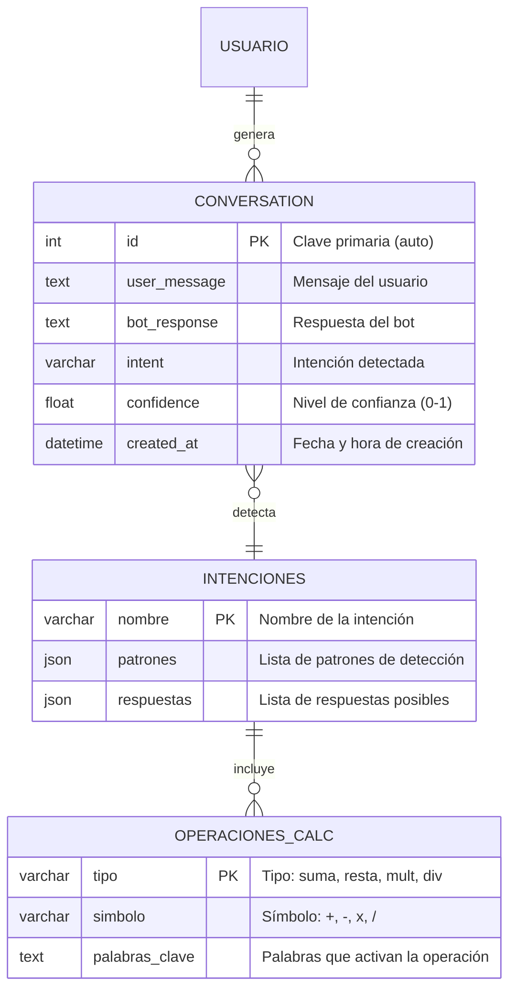

# Diagrama Entidad-Relación — LóngBot

## Modelo de Base de Datos

## Detalle del Modelo Conversation

| Campo | Tipo | Descripción | Restricciones |
|---|---|---|---|
| `id` | `AutoField` | Identificador único | PK, auto-increment |
| `user_message` | `TextField` | Mensaje escrito por el usuario | No nulo |
| `bot_response` | `TextField` | Respuesta generada por el bot | No nulo |
| `intent` | `CharField(100)` | Intención detectada por la RN | No nulo |
| `confidence` | `FloatField` | Nivel de confianza (0.0 a 1.0) | Default=0.0 |
| `created_at` | `DateTimeField` | Timestamp de creación | auto_now_add |

## Intenciones Disponibles (16 + Calculadora)

| Intención | Patrones | Descripción |
|---|---|---|
| `saludo` | 15 | Saludos y bienvenidas |
| `despedida` | 12 | Despedidas |
| `hora` | 8 | Consulta de hora actual |
| `fecha` | 8 | Consulta de fecha actual |
| `inteligencia_artificial` | 10 | Información sobre IA |
| `nombre` | 9 | Identidad del bot |
| `ayuda` | 10 | Menú de funciones |
| `chiste` | 9 | Humor y bromas |
| `clima` | 10 | Información del clima |
| `agradecimiento` | 10 | Agradecimientos |
| `estado` | 8 | Estado del bot |
| `filosofia` | 18 | Filosofía china |
| `creador` | 6 | Información del creador |
| `musica` | 7 | Recomendaciones musicales |
| `calculadora` | 18 | Operaciones matemáticas |
| `matematicas` | 7 | Consultas matemáticas generales |
